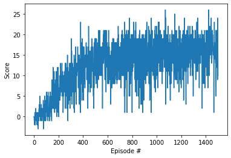
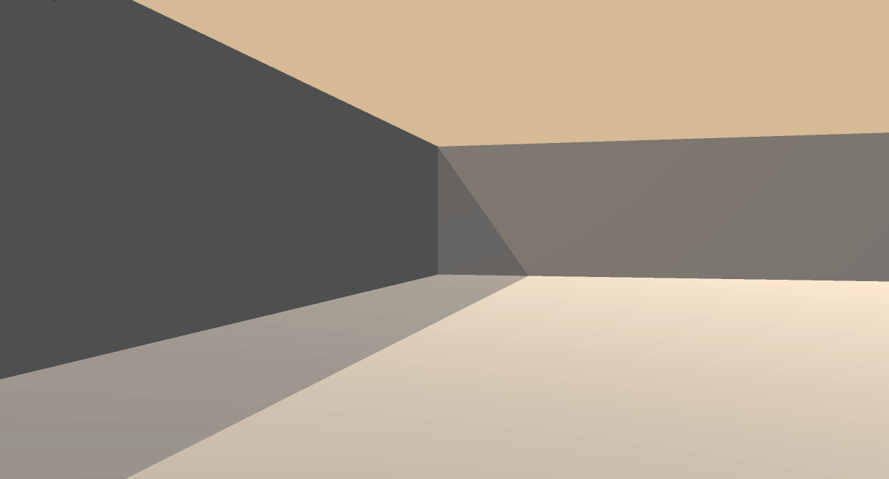

#Deep Reinforcement Learning: Project Navigation


I have explored the details from the [DQN Paper](https://storage.googleapis.com/deepmind-media/dqn/DQNNaturePaper.pdf) 
Then revisited the coding excercise from the lesson Deep Q-Networks. Adapted the code from the lesson, tried to tweak various hyperparameters. Solved the project on my GPU laptop.

###1. Started the Unity enviornment:
```
env = UnityEnvironment(file_name="./Banana_Linux/Banana.x86_64")
```
Environments contain brains which are responsible for deciding the actions of their associated agents. Here we check for the first brain available, and set it as the default brain we will be controlling from Python.

### 2. Examine the State and Action Spaces

The simulation contains a single agent that navigates a large environment. At each time step, it has four actions at its disposal:

0 - walk forward
1 - walk backward
2 - turn left
3 - turn right
The state space has 37 dimensions and contains the agent's velocity, along with ray-based perception of objects around agent's forward direction. A reward of +1 is provided for collecting a yellow banana, and a reward of -1 is provided for collecting a blue banana.

###3.Model for agent and neural network
Agent Class was created in the dqn_agent.py file. It contains satic parameters as mentioned below:

BUFFER_SIZE = int(1e5)  # replay buffer size
BATCH_SIZE = 64         # minibatch size
GAMMA = 0.9            # discount factor
TAU = 1e-3              # for soft update of target parameters
LR = 4.5e-4               # learning rate 
UPDATE_EVERY = 4        # how often to update the network

While training the agent tweaked some of the parameters. Lesser learning rate and more GAMMA than mentioned above made the training little unstable and solution observed as diverged. 
Agent object was initialsed with state,action size and NN objects created for target and locat state-value function.
Agent class has step function which evaluates step value functions using deep learning models. Act fuction for the agent selects action for the given state. Action selection process also trained using the deep learning model and hence decoupled from the step-value evaluation.


### 4. Train the agent with DQN

It implements fixed Q-targets and Double DQN which require two Q-networks with the same structure:
online Q-network for choosing actions and target Q-network used for learning to avoid harmful correlations 
and overestimation of the action values.

Training of the agent is implemented as below:

1. Every timestep observation of the environment (state) is provided to the agent and the agent selects the action 
2. Then, the next state of the environment is observed and the reward is received, e.g. +1 for collected yellow banana. 
We also get the information whether the episode is completed (done).
3. State, action, next state and the reward constitute the experience used to the agent for learning. The agent adds this experience to its replay memory and when there are enough experiences collected it starts learning
 
### 5.Learning with the prioritized experience replay, fixed Q-targets and Double DQN :

1. A batch of experiences is sampled from the replay memory.
2. For each experience, the next action for the next state is selected to maximize the Q-values estimated from 
the online Q-network.
3. Target Q-values for the current state and action are computed as the sum of the reward and the estimated Q-value from 
the target Q-network for the next state and the action selected in the previous step.
3. Expected Q-values for the current state is estimated from the online Q-network.
4. Temporal difference errors (TD-error) are computed as the difference between the target and expected Q-values.
5. Mean squares error loss is computed for the TD-errors.
6. Parameters of the online Q-network are updated by minimizing the loss through backpropagation
7. Parameters for the target Q-network are updated with the weighted sum of the target and online parameters.
9. Priorities of the sampled experiences are updated based on the TD-errors.

### 6. Deep Learning Model

Q-network maps state to Q-values for each action. 
Current implementation uses a dense neural network with two hidden layers where each layer has 64 nodes with 
rectified linear unit activation function. 

The complete architecture is as follows:
 
- Input: 37 nodes (state size)
- Hidden layer 1: 64 nodes
    - Rectified linear unit activation 
- Hidden layer 2: 64 nodes
    - Batch normalization
    - Rectified linear unit activation
- Output layer: 4 nodes (number of actions)


###Results

The agent was able to solve the environment by achieving score of 13 over 100 consecutive episodes after 550 episodes.

<p align=center></p>


### 4. Watch a Smart Agent!
Loaded the trained weights from file to watch a smart agent!
<p align=center></p>